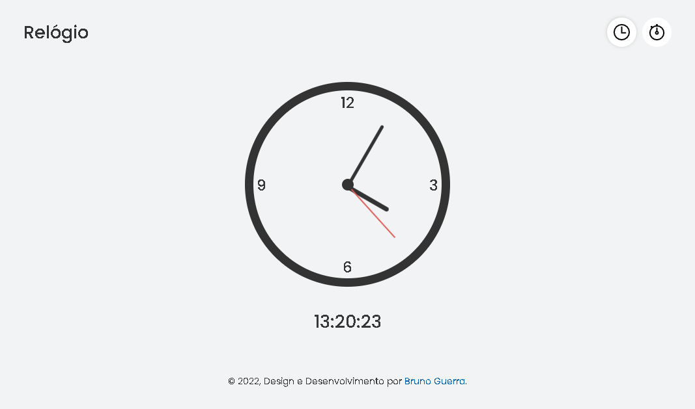
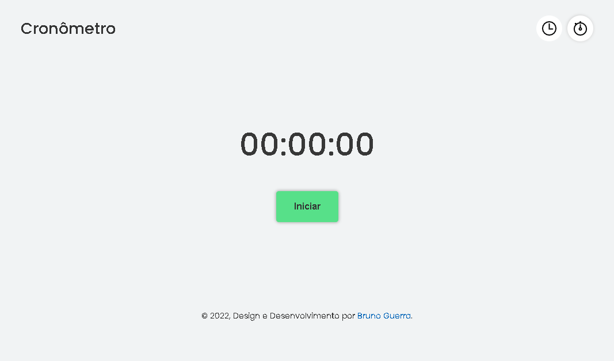

## Stopwatch and Clock App

Real-time clock app. And stopwatch with start, pause, restart and stop button

## Technology

Here are the technologies used in this project.

- HTML5
- CSS3
- JQuery

## Services Used

- Github
- Vercel

## Getting started

- Dependency

- None, just download and use

## How to use

### 1 - Watch app page

### 2 - Stopwatch app page

## Features

The main features of the application are:

- Show real-time and current time
- Start a stopwatch with start, pause, restart and stop buttons

## Links

- Deploy on Vercel: https://app-clocktimer.netlify.app/
- Repository: https://github.com/brunorguerra/App-ClockTimer

## Versioning

1.0.0.0

## Authors

- **Bruno Bernardes Guerra**

Please follow github and join us!
Thanks to visiting me and good coding!
